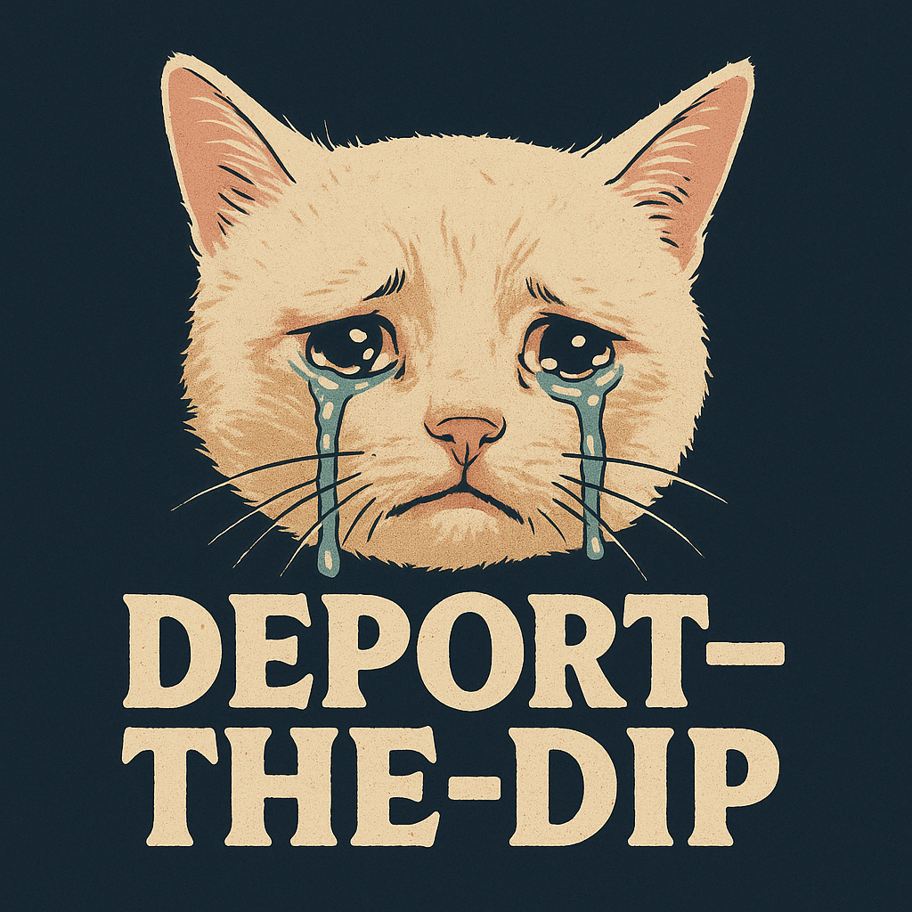
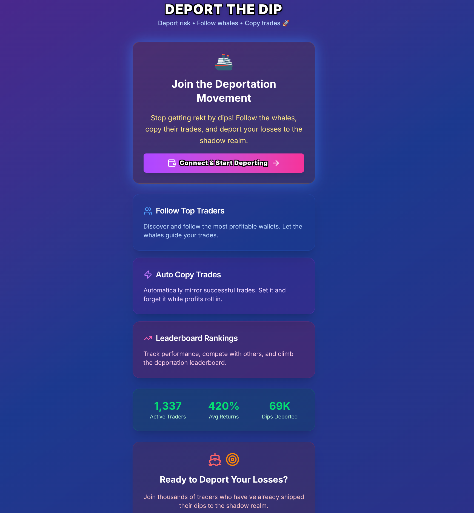
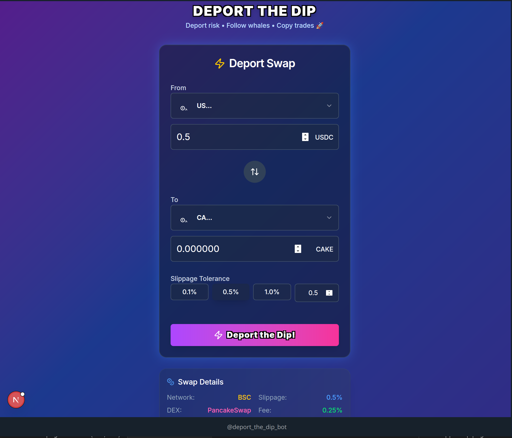
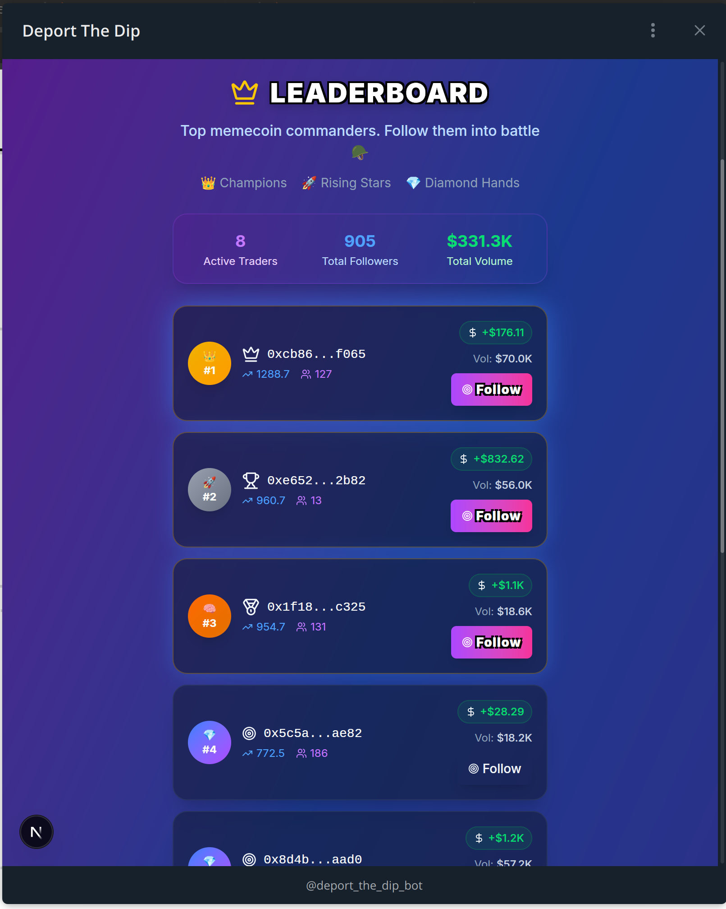
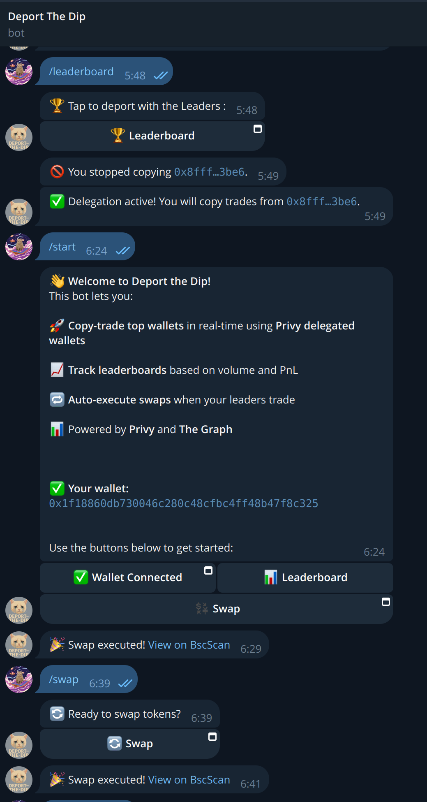

# Deport‑the‑Dip

<p align="center">
  
</p>

A **three‑tier DeFi copy‑trading stack** composed of:

| Layer            | Tech                          | Folder         | Purpose                                                                         |
| ---------------- | ----------------------------- | -------------- | ------------------------------------------------------------------------------- |
| Telegram Bot     | **Express** + **Telegraf**    | `bot/`         | On‑ramps users, pushes swap notifications, receives commands                    |
| Mini‑App         | **Next.js 14 / React**        | `miniapp/`     | Wallet UI for approving & executing swaps, follow/unfollow leaders, leaderboard |
| DeFi gRPC Server | **Bun** + **PancakeSwap SDK** | `defi-server/` | Builds & submits BNB Chain swap txs, handles delegated copy trades              |

> This monorepo aggregates the latest snapshots of the three codebases as Git submodules, the shared protocol buffers, and demo assets in one place for easy cloning and judging during the hackathon.

## Quick‑Start (Local)

\### 0. Clone

```bash
git clone --recurse-submodules https://github.com/reymom/deport-the-dip.git
cd deport-the-dip
cp .env.example .env   # Fill in all secrets first!
```

\### 1. DeFi gRPC Server

```bash
cd defi-server
bun install
bun run dev
```

Exposes:

- `TransactionService.BuildUnsignedTx` & `SubmitSignedTx`
- `SwapService.ExecuteSwap` (delegated / copy‑trade)

\### 2. Telegram Bot

```bash
ngrok http 8443 --host-header=rewrite
export BOT_WEBHOOK_BASE=https://<generated>.ngrok.io

cd bot
bun install
bun run dev
```

\### 3. Mini‑App

```bash
cloudflared tunnel --url http://localhost:3000
export NEXT_PUBLIC_MINIAPP_BASE=https://<generated>.trycloudflare.com

cd miniapp
npm install
npm run dev
```

Open Telegram, send `/start` to the bot and enjoy 🚀

## Folder Structure

```
proto/          # *.proto contracts used by server & mini‑app
images/         # Logos & screenshots
defi-server/    # Git submodule
bot/            # Git submodule
miniapp/        # Git submodule
```

## Environment Variables

| Variable                                                | Description                              |
| ------------------------------------------------------- | ---------------------------------------- |
| `NEXT_PUBLIC_PRIVY_APP_ID`                              | Privy public id                          |
| `PRIVY_APP_ID`, `PRIVY_APP_SECRET`, `PRIVY_SIGNING_KEY` | Server‑side Privy creds                  |
| `BSC_RPC`                                               | BNB Chain RPC URL                        |
| `SUPABASE_URL`, `SUPABASE_KEY`                          | Supabase project connection              |
| `BOT_TOKEN`                                             | Telegram bot token                       |
| `BOT_WEBHOOK_BASE`                                      | Public https base created by ngrok       |
| `NEXT_PUBLIC_MINIAPP_BASE`                              | Public https base created by cloudflared |
| _(others)_                                              | See `.env.example`                       |

## Screenshots






## Roadmap

- Integrate **The Graph** for real‑time on‑chain leader stats
- 🚧 Gas estimation & slippage config
- UI polish & dark‑mode

---

MIT © 2025 Reymom & Contributors
